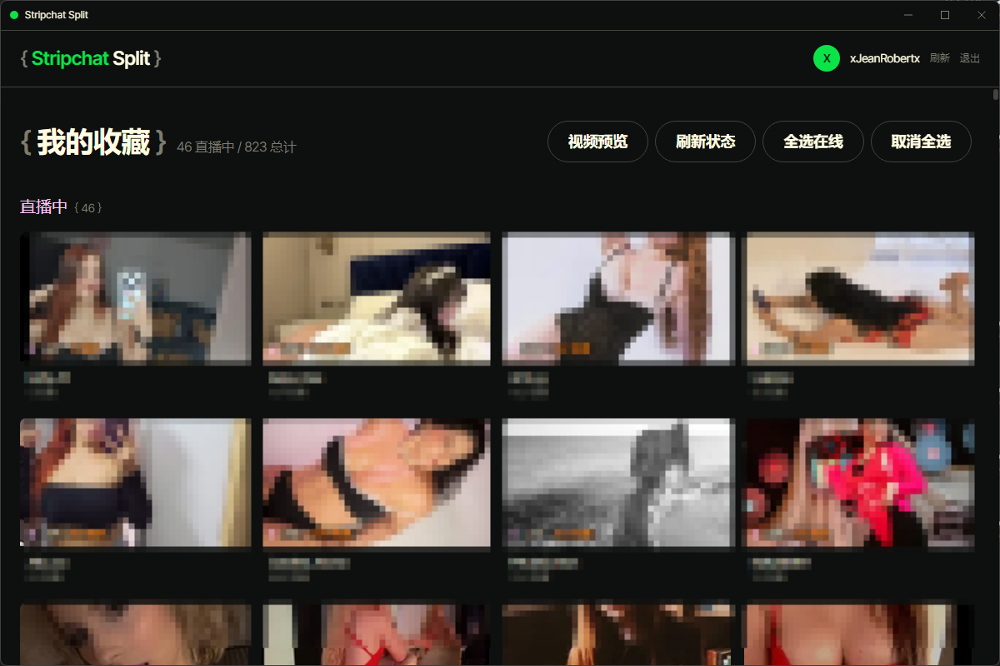

# Stripchat Split

> Electron 桌面直播播放器 — 收藏管理 · 分屏多路观看 · HLS 直播流播放



## 功能特性

### 🎬 直播播放
- HLS 直播流播放（hls.js + Mouflon DRM 解密）
- 多清晰度切换（自动/手动选择分辨率）
- 视口驱动的视频预览（滚出视口自动暂停，节省 CPU）

### 📋 收藏管理
- 在线/离线主播分类展示
- 实时直播状态检测（cam API 确认）
- 批量选择 + 一键全选在线主播
- 封面/视频预览模式切换

### 🖥️ 分屏观看
- 最多 16 路同时播放
- 智能清晰度控制（超过 9 路自动降档保护 CPU）
- 网格自适应布局
- 每格独立清晰度切换

### 🔐 登录与安全
- 外部浏览器登录（Chrome/Edge）
- Cookie 自动同步到应用
- 主进程 API 网关（绕 Cloudflare TLS 指纹）
- CSP 安全策略 + IPC 域名白名单

### 🎨 界面设计
- GSAP 设计系统（近黑画布 + 奶油色文字）
- 自定义标题栏（无边框窗口）
- 幽灵描边按钮 + 分类颜色标签

## 快速开始

### 环境要求
- Node.js 18+
- pnpm 8+
- Google Chrome 或 Microsoft Edge

### 安装

```bash
git clone https://github.com/YFPS/stripchat-split.git
cd stripchat-split
pnpm install
```

### 开发

```bash
pnpm dev
```

### 构建

```bash
pnpm build
```

构建产物输出到 `release/` 目录。

## 技术栈

| 层级 | 技术 |
|------|------|
| 桌面壳 | Electron 28 |
| 渲染进程 | React 18 + TypeScript |
| 状态管理 | Zustand |
| 样式 | TailwindCSS |
| 构建 | Vite 5 |
| 播放器 | hls.js |
| 测试 | Vitest |

## 项目结构

```
stripchat-split/
├── electron/              # 主进程
│   ├── main.ts            # 入口：窗口管理、IPC 注册
│   ├── window.ts          # BrowserWindow 工厂
│   ├── preload.ts         # contextBridge
│   ├── api-gateway.ts     # API 网关（绕 CF 指纹）
│   ├── stream-gateway.ts  # 直播流探测
│   ├── login.ts           # 登录流程
│   └── browser-path.ts    # 浏览器路径探测
├── src/                   # 渲染进程
│   ├── components/        # UI 组件
│   ├── stores/            # Zustand 状态
│   ├── services/          # 业务逻辑
│   ├── hooks/             # React Hooks
│   └── types/             # 类型定义
├── scripts/               # 开发脚本
└── vite.config.ts         # Vite 配置
```

## 安全说明

- Cookie 操作限制为 `stripchat.com` 域名
- API 网关只允许 `/api/` 路径，防止 SSRF
- 主窗口禁止 `window.open` 弹出
- 敏感配置文件不纳入版本控制

## 许可证

MIT License
